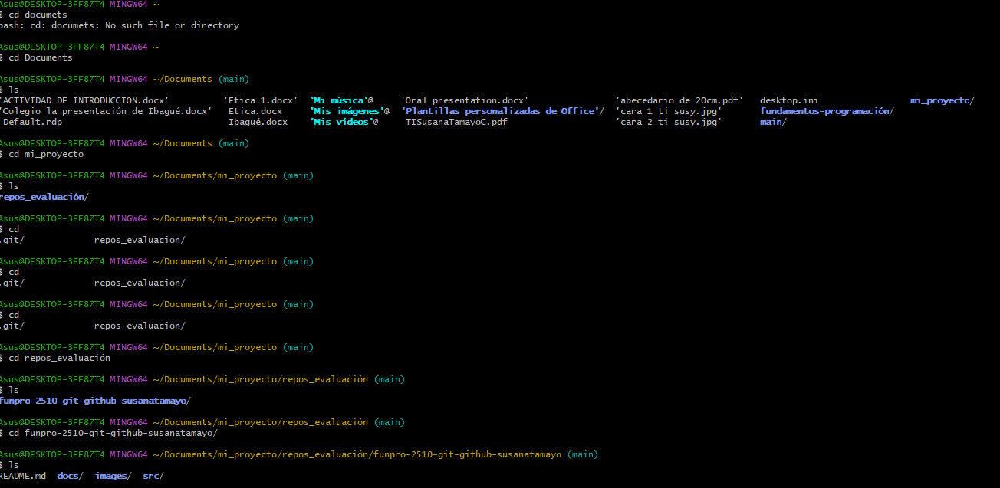
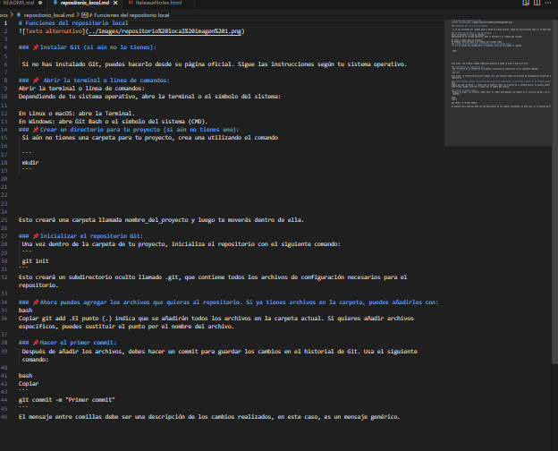
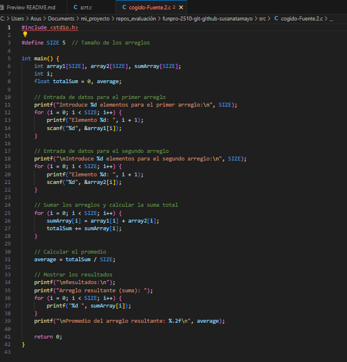

[](https://classroom.github.com/a/IYE4ssuc)
# 📖Bitacora.
### Información del estudiante.  
📝Nombre del estudiante:  Susana Tamayo

✅Id.:567398

### 📂Tabla de contenido.
| Archivo |Descripción | Link |
|--------------|--------------|-----
| Objetivos.|Describe la intención principal del pyoyecto.| 
| Conceptos Preliminares. | Creación de directorios o archivos,renombrar y traslado de archivos o directorios, busqueda de archivos o directorios y eliminación de archivos o directorios.|
| docs|Conceptos y funciones del comando gitignore, repositorio local,repositorio remoto y uso de la conlosa.|[Carpeta de Docs](https://funpro-2510-git-github-susanatamayo/docs)
| images|En este archivo se pueden encontrar todas las imagenes incertadas en el los documentos m.d  | [Carpeta de Images](https://funpro-2510-git-github-susanatamayo/images)
| src| Codigo ejemplo de inclución de un archivo funcional al proyecto|[Carpeta de src](https://funpro-2510-git-github-susanatamayo/src)
| gitignore| Uso del comando .gitignore.|
| Uso de Markdown.|Concepto, función y comandos de Markdon.|

### ✅ Objetivos.
El objetivo principal de la actividad infiere en crear y estructurar un proyecto de programación usando programas como Git y GitHub, ademas comprender el uso de la consola en terminos de navegación y creación de directorios y archivos, crear repositorios locales usando comandos en git, finalmete la generación de repositorios remotos en GitHub y la sincronización entre repositorio(loca y remoto)

### 📓Conceptos Preliminares.
Los conceptos prelimanres, permiten reconocer aquellos comandos necesarios para el uso basico de programas como: Git bash, GitHub y Visual estudio code.
#### Comandos de manipulación de archivos y directorios.🛠️

1. ##### Creación de Directorios.📚
``` 
mkdir nombre-del-directorio
``` 
Este comando permite generar un directorio con un nombre en especifico.

2. ##### Creacion de Archivos.🔐

``` 
touch nombre-del-directorio
``` 
Este comando genera un archivo con un nombre en especifico (vacio)

3. ##### Renombre y traslado de archivos y directorios.🏃‍♂️‍➡️🏃

``` 
mv nombre-origen nombre-destino
``` 
``` 
mv nombre-actual nuevo-nombre
``` 
Estos comandos tienen la capacidad de trasladar un archivo o directorio a una ubicación nueva, ademas puede renombrar los archivos o directorios.

4. ##### Busqueda de archivos. 🕵️

``` 
findo . -name "nombre-del-archivo"
``` 
Este comando busca directorios o archivos mediaante su nombre especifico, ya sea en un directorio actual o subdirectorios.

5. ##### Eliminación un archivo o directorio. 🚮

``` 
rm nombre-del-archivo
``` 
``` 
rm -r nombre-del-directorio
``` 

Estos comandos poseen la capacidad de eliminar un archivo o directorio en especifico de manera irreversible.

### 📄Docs
En esta carpeta se encuentra la información relacionada con el usos de la consola, conceptos y metodos para crear y sincronizar los repositorios.
1. #### Uso de la consola. 🖥️

La consola o terminal es una herramienta fundamental para interactuar con el sistema operativo de manera eficiente. Permite ejecutar comandos para realizar diversas tareas sin necesidad de una interfaz gráfica. 



2. #### Reposito local. 📁

Es un contenedor de archivos que se encuentra en tu ordenador. Éste puede tener un proyecto lleno de diferentes archivos y es allí donde vas haciendo tus modificaciones y guardardolas para así, ir creando varias versiones.



3. #### Repositorio remoto. 🌐

Los repositorios remotos son versiones de un proyecto que se almacenan en un servidor o servicio en línea y que permiten la colaboración entre desarrolladores,Algunas de las 
funciones de un repositorio remoto son:

a)Almacenar versiones de un proyecto.

b)Permitir la colaboración entre desarrolladores.

c)Guardar artefactos de fuentes externas.

d)Sincronizar repositorios.

e)Permitir el intercambio de código.

f) Proporcionar control de versiones.

Los repositorios remotos pueden ser de solo lectura o de lectura y escritura. 
Para trabajar con repositorios remotos, se puede utilizar un servicio como GitHub, Bitbucket o Gitlab. También es posible configurar un servidor de git en un servidor propio o alquilado.


4. #### Gitignore.🤷🏻‍♀️

El archivo .gitignore permite ignorar archivos y carpetas en un repositorio de Git. Esto ayuda a mantener el repositorio organizado y a evitar que se rastreen archivos innecesarios. 

Las funciones de gitignore son: 
a) Excluir archivos y directorios del control de versiones.

b) Mantener el repositorio limpio y organizado.

c) Evitar que se rastreen archivos innecesarios.


### 🖼️Images 
En este archivo se pueden encontrar todas las imagenes incertadas en el los documentos m.d 
``` 

``` 
Este comando permite pegar imagenes ya se por medio de una URL o desde los archivos de la computadora.

### 🖥️Src 

En este archivo se encuentra un codigo con ejemplificaciones de como incluir un archivo funcional al proyecto.



### 🚮Gitignore. 

En este archivo estan depositados aquellos archivos los cuales se desean ignorar.
Para ellos usamos el comando ```.gitignore``` en al archivo el cual se quieren desatender.

### 🔣Usos de Markdown. 
Markdown es un lenguaje de marcado que permite agregar formato a texto sin usar etiquetas HTML,se trata de un código de texto plano que usa símbolos sencillos para crear texto enriquecido. 

1. #### Algunos comandos de markdown. ✨

##### Titulos. 🔠
``` 
# Título 1
## Título 2
### Título 3
#### Título 4
##### Título 5
###### Título 6
``` 
##### Enlaces. 🔗
``` 
[Texto del enlace](URL)
``` 
##### Imágenes. 🖼️
``` 

``` 
##### Tablas.⏹️
``` 
| Encabezado 1 | Encabezado 2 |
|--------------|--------------|
| Fila 1 Col 1 | Fila 1 Col 2 |
| Fila 2 Col 1 | Fila 2 Col 2 |

``` 
#### Emojis. 🏋🏻‍♀️

``` 
windows .
``` 
